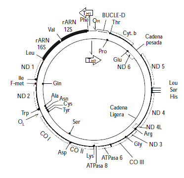
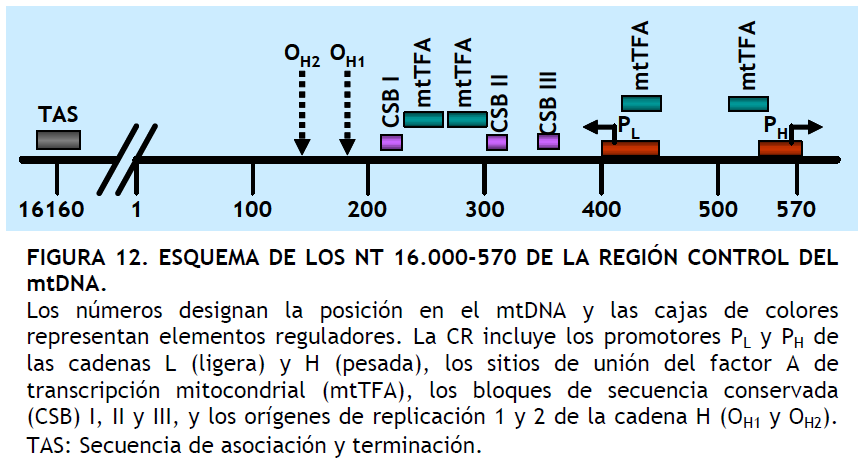

# Introducción  
## El Genoma Mitocondrial  

El ADN mitocondrial humano (mtADN)  es una molécula de doble cadena, circular de 16,569 pares de bases (pb). Contiene 37 genes que codifican: 13 proteínas de la  cadena de fosforilación oxidativa, 7 subunidades para el complejo I, 1 para la subunidad III, 3 subunidades del complejo IV y 2 subunidades del complejo V; así como 22 ARN de transferencia y dos ARN ribosomales (12S y 16S) esenciales para la síntesis de proteínas dentro de la mitocondria [Shen et al. 2011](https://nyaspubs.onlinelibrary.wiley.com/doi/abs/10.1111/j.1749-6632.2010.05635.x) (Figura 1).  Las cadenas del mtADN reciben el nombre de cadena H (pesada o heavy) por su alto contenido en guanina (G), y la cadena L (ligera o light). La cadena H contiene la mayor parte de las secuencias codificantes (28 genes). La cadena L solamente contiene la información para la subunidad 6 de la NADH deshidrogenasa y ocho tRNA (Attardi,[1988).  
  

   
Figura 1. Genoma mitocondrial. Se muestran los genes que codifican: rRNA 12S y 16S, tRNA señalados con la abreviatura del aminoácido que transportan, y secuencias codificantes de proteínas: 3 subunidades de la Citocromo C Oxidasa (CO I, CO II, COIII), 1 para el Citocromo B (Cyt. b), 6 subunidades de la NADH Deshidrogenasa (ND1, ND2, ND3, ND4, ND4L, ND5, ND6) y 2 de la ATP sintasa (ATPasa 6 y ATPasa 8). Además se observan las cadenas ligera y pesada, el origen de la replicación de la cadena pesada (OH), el origen de la replicación de la cadena ligera, y los promotores de la transcripción TH y TL. Así como el Bucle D.
  
El asa de desplazamiento o bucle-D (D-loop), es una estructura donde las 2 hebras de la doble cadena de la molécula de ADN están separadas por una tercera hebra de ADN. La tercera hebra tiene una secuencia que es complementaria a una de las hebras principales y se aparea con ella, desplazando a la otra cadena principal, la cual forma una estructura en forma de horquilla por complementariedad de bases (Shen et al, 2011). El D-loop es la región mayor no codificante, ocupa 1122 pares de bases y se sitúa entre los genes que codifican para los tRNAs de prolina y el de fenilalanina.  En el D-loop  se encuentran el origen de replicación de la cadena H (OH), los promotores para la transcripción de la cadena pesada (PH) y de la cadena ligera (PL), además de dos lugares de unión a factores de transcripción (Tfam), tres bloques de secuencias conservados asociados con el inicio de la replicación (CSB I, CSB II y CSB III) y las secuencias asociadas a la terminación de cadenas (TAS) (Coskun et al. 2003) (Figura 2). Esta región destaca por su elevada tasa de mutación, aproximadamente 10 veces mayor que en las regiones codificantes del mtADN (Vigilant et al. 1991) y por su elevada variabilidad intrapoblacional, la cual se concentra en tres regiones o segmentos hipervariables (HVS): la región hipervariable I (HVSI) abarca las posiciones 16,024-16,365, la región hipervariable II (HVS II) las posiciones 73-340 y la región hipervariable III (HVS III) las posiciones 438-574. La región más polimórfica es la región HVS I, por lo que ha sido utilizada en estudios de genética, paleogenómica, antropología y la medicina forense.

   

Figura 2. Esquema de la región control o asa de desplazamiento (D-loop) del  mtADN desde la posición 16,000 a la 600. Los números designan la posición en el mtADN y las cajas de colores representan elementos reguladores. La región control incluye los promotores de las cadenas L (ligera) y H (pesada), los sitios de unión del factor A de transcripción mitocondrial (mtTFA), los bloques de secuencia conservada (CSB) I, II y III, y los orígenes de replicación 1 y 2 de la cadena H (OH1 y OH2). TAS: Secuencia de asociación y terminación.
La secuencia completa del genóma mitocondrial de un humano se publicó por primera vez en 1981 (Anderson et al. 1981). Desde entonces se emplea como la secuencia de referencia (CRS) con la que se comparan las diferencias encontradas en otros genomas mitocondriales. No obstante, en 1999 se publicó una versión corregida de esta secuencia (revised Cambridge Reference Sequence, (rCRS)) manteniendo la numeración original (Andrews et al. 1999), por lo que es la que se utiliza actualmente como referencia en todos los estudios en los que se analiza mtADN humano. 

## Características del genoma mitocondrial humano  

El genoma mitocondrial posee ciertas características especiales que lo distinguen del genoma nuclear. Entre las principales está lo compacto que es dicho genoma, casi todos sus genes se encuentran uno inmediatamente después del otro, aunque existen pequeñas secuencias intergénicas, siendo la mayor el D-loop (Anderson et al. 1981).

## Herencia Materna  

La herencia del mtADN no sigue las leyes mendelianas, ya que no se recombina durante la fecundación, el mtADN es esencialmente heredado vía materna lo que permite trazar su linaje (Brandon et al., 2006). El ovocito es quién aporta la mayoría de mitocondrias durante la fecundación, ya que las mitocondrias paternas se encuentran en la cola del espermatozoide y ésta se pierde en el momento de la fecundación, por lo que la cantidad de mitocondrias aportadas vía paterna es muy baja. Las pocas mitocondrias paternas aportadas suelen eliminarse al ser reconocidas y ubiquitinadas para su degradación (Sutovsky et al. 1999). Además, también se han descrito su eliminación mediante autofagia por degradación lisosomal (Sato & Sato 2011, Al Rawi et al. 2011).

## Haplogrupos  

Debido a las características de herencia del mtADN, las poblaciones humanas pueden ser divididas en base a la variación de secuencia en ciertas posiciones del genoma mitocondrial, conocidas como polimorfismos de nucleótidos simples (SNPs). Estas mutaciones acumuladas en periodos de tiempo relativamente cortos, se agrupan secuencialmente formando linajes independientes conocidos como haplotipos (Torroni et al. 1996). En el proceso de la evolución y migraciones humanas, los descendientes de un haplotipo original podrían acumular posteriormente mutaciones adicionales y generar un grupo relacionado de haplotipos que es conocido como haplogrupo (Rui et al. 2011). El análisis de la distribución de los SNPs en la población permite la reconstrucción de las antiguas migraciones humanas. En la actualidad existen árboles filogenéticos basados en las secuencias de los distintos haplogrupos (van Oven & Kayser. 2008).

## Elevada Tasa de Mutación  

La tasa de mutación del mtADN, es de 5 a 10 veces mayor en comparación con el ADN nuclear (Ritcher, 1988), esto se debe principalmente a que el genoma mitocondrial se encuentra asociado por cercanía a la membrana mitocondrial interna, la cual es el sitio principal de producción de especies reactivas de oxigeno (ROS). Esto hace al mtADN más susceptible a daño por ROS comparado con el ADN nuclear. Además, el D-loop, al no estar apareado es mucho más susceptible a daño, esto origina una tasa de mutación 100 veces mayor que en núcleo (Ritcher, 1988). La acumulación de dichas mutaciones a lo largo de generaciones ha originado variabilidad genética en esta región del mtADN, lo que ha sido aprovechado para realizar estudios filogenéticos.

