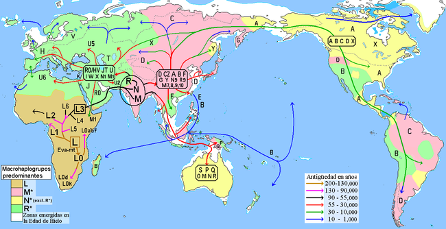

## Secuenciación  
Las muestras que producimos se secuenciaron en el Laboratorio de Servicios Genómicos del Laboratorio Nacional de Genómica Para La Biodiversidad. Se necesitan 20 µl de una reacción de PCR de cada muestra a una concentración mínima de ADN de 100 ng  totales.   
Esta secuenciación es por el método de Sanger (secuenciación por capilares) y para esto es necesario hacer un PCR con los primers usados para amplificar la región D-loop.  

## Análisis de resultados de la secuenciación   

La calidad de las secuencias, la extracción de las mismas y los electroferogramas se analizan con la ayuda del software Finch TV (versión 1.4.0) (Geospiza Inc. 2006).   

En un cromtagroma la intensidad de la señal representa las cuatro bases en diferentes colores. Verde para adenina, rojo para timina, negro para guanina y azul para citosina.  

Si quieres analizar el electroferograma en tu computadora aquí puedes [descargar Finch TV](https://slackware.pkgs.org/14.1/slackonly-x86_64/finchtv-1.3.1-i386-1_slack.txz.html).  
   

### Identificación de haplogrupos mitocondriales   

La determinación de haplogrupo (figura 6) se realiza utilizando los resultados obtenidos por secuenciación y se analiza con la ayuda de mitomap en el sitio web https://www.mitomap.org.  

   
Figura 5.- En este mapa se muestran los haplogrupos identificados por letras y las regiones de donde provienen.  

## Búsqueda de secuencias  
### Blast
Basic Local alignment search tool. Blast es un alineador múltiple de secuencias que nos ayuda a encontrar otras parecidas. Hagamos blast del 16s de Streptomyces coelicolor.  
[blastn](https://blast.ncbi.nlm.nih.gov/Blast.cgi?PAGE_TYPE=BlastSearch)  
[blastp](https://blast.ncbi.nlm.nih.gov/Blast.cgi?PAGE=Proteins)  
