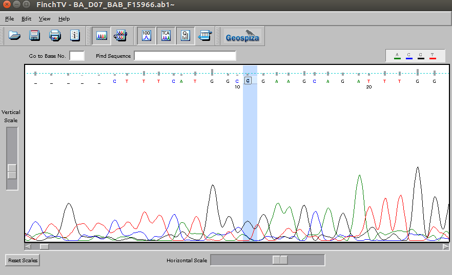

# Sesión 6 Visualización y búsqueda de secuencias  

## 6.1 Visualización de secuencias  
### Datos de secuenciación  
Las muestras que producimos se secuenciaron en el Laboratorio de Servicios Genómicos del Laboratorio Nacional de Genómica Para La Biodiversidad. Se necesitan 20 µl de una reacción de PCR de cada muestra a una concentración mínima de ADN de 100 ng  totales.   
Esta secuenciación es por el método de Sanger (secuenciación por capilares) y para esto es necesario hacer un PCR con los primers usados para amplificar la región D-loop.  

### Análisis de calidad de resultados de la secuenciación   

La calidad de las secuencias, la extracción de las mismas y los electroferogramas se analizan con la ayuda del software Finch TV (versión 1.4.0) [Geospiza Inc. 2006](http://informatics.perkinelmer.com/Support/SupportNews/details/?SupportNews=124). En un cromatogroma la intensidad de la señal representa las cuatro bases en diferentes colores: verde para adenina, rojo para timina, negro para guanina y azul para citosina. Utilizaremos la versión de FinchTV que se encuentra en el escritorio de tu computadora. FinchTV es un programa que se inicia desde la terminal, asi que para comenzar a analizar tu secuencia necesitarás aplicar tus conocimientos de linux.  
  
    
>Ejercicio Visualizar la calidad de tu secuencia con FinchTV  
> 1. Descarga tu secuencia de tu correo.  
> 2. Abre una terminal y verifica en qué directorio estás.
> pwd  
> 3. Mueve tu secuencia desde el directorio Descargas hasta tu directorio que creaste en el escritorio. 
>   mv /home/user/Descargas/misecuencia.seq /home/user/Escritorio/miDirectorio/misecuencia.seq  
> 4. Cámbiate en la terminal al directorio FinchTV    
> 5. Abre la carpeta usr
> 6. Abre la carpeta bin
> 7. Ejecuta el programa FinchTV  
> 8. ./finchtv  
> 9. Arrastra tu secuencia hasta la interfaz de FinchTV. ¿Qué observas?  

Si quieres analizar el electroferograma en tu computadora aquí puedes [descargar Finch TV](https://slackware.pkgs.org/14.1/slackonly-x86_64/finchtv-1.3.1-i386-1_slack.txz.html).  
   

## 6.2 Búsqueda de secuencias en bases de datos.    
### Blast  
La herramineta BLAST Basic Local alignment search tool es un alineador múltiple de secuencias que nos ayuda a encontrar otras parecidas. BLAST está disponible para realizar búsquedas en NCBI, pero también puedes descargarlo y realizar búsquedas en tus propias bases de datos. Existen distintas versiones de blast según el tipo de secuencia que tengas, por ejemplo están: 
  
[blastn](https://blast.ncbi.nlm.nih.gov/Blast.cgi?PAGE_TYPE=BlastSearch)  Para análisis de DNA.    
[blastp](https://blast.ncbi.nlm.nih.gov/Blast.cgi?PAGE=Proteins)  Para análisis de proteínas.  

Hagamos blast en NCBI de tu secuencia mitocondrial.  
